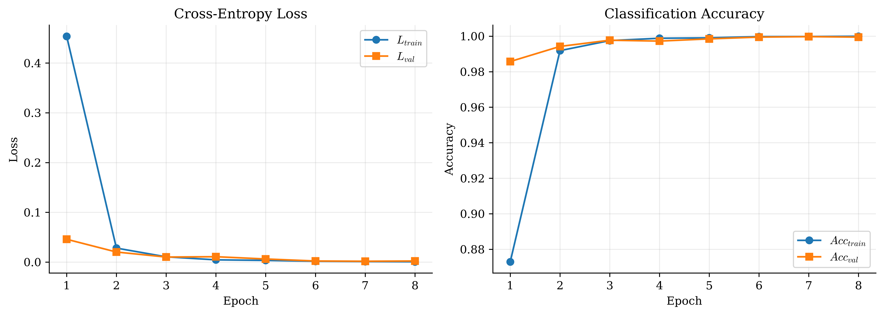

# German Traffic Sign Recognition with PyTorch

**Author:** Ziraddin Gulumjanli, 2026

A compact, production-style computer vision project for classifying German traffic signs from the **GTSRB** dataset.



This repository is designed to be simple but professional:

- PyTorch training pipeline
- Torchvision dataset download with `download=True`
- CNN baseline and ResNet18 transfer learning
- validation split, test evaluation, and saved metrics
- [Matplotlib-only reporting figures](https://github.com/ziraddingulumjanly/matplotlib-plot-recipes)
- FastAPI inference endpoint
- Dockerfile, Makefile, pyproject.toml, requirements.txt, GitHub Actions

## Problem

The model learns a mapping

\[
    f_\theta(x) \rightarrow \hat{y}, \qquad \hat{y} \in \{0, 1, \dots, 42\}
\]

where \(x\) is a traffic sign image and \(\hat{y}\) is one of 43 GTSRB traffic sign classes.

## Dataset

The project uses `torchvision.datasets.GTSRB`, so the dataset can be downloaded directly from code:

```python
from torchvision.datasets import GTSRB

train_dataset = GTSRB(root="data", split="train", download=True)
test_dataset = GTSRB(root="data", split="test", download=True)
```

## Setup

```bash
python -m venv .venv
source .venv/bin/activate  # Windows: .venv\Scripts\activate
pip install -r requirements.txt
pip install -e .
```

## Full training

```bash
make train
```

## Evaluation

```bash
make evaluate
```


## FastAPI

Run locally:

```bash
make api
```

Then open:

```text
http://localhost:8000/docs
```

Health check:

```bash
curl http://localhost:8000/health
```

Image prediction:

```bash
curl -X POST "http://localhost:8000/predict" \
  -F "file=@path/to/sign.png"
```

## Docker

Build:

```bash
make docker-build
```

Run:

```bash
make docker-run
```

The container expects the trained model to exist at:

```text
models/gtsrb_resnet18_best.pt
```

You can mount your local model folder:

```bash
docker run --rm -p 8000:8000 \
  -v "$(pwd)/models:/app/models" \
  gtsrb-classifier:latest
```

## Matplotlib style

The plotting utilities in `src/gtsrb_classifier/plots.py` use a clean Matplotlib recipe style:

```python
plt.rcParams["figure.dpi"] = 600
plt.rcParams["savefig.dpi"] = 600
plt.rcParams["mathtext.fontset"] = "cm"
plt.rcParams["font.family"] = "serif"
```

Reusable plotting functions:

```python
from gtsrb_classifier.plots import plot_confusion_matrix, plot_training_curves
```

